# Vorstellung

Dieses Projekt ist eine **prototypische Lernplattform für Programmierung**, die Aufgaben ähnlich wie bekannte Plattformen *Codewars* oder *LeetCode* bereitstellt.  
Die Nutzer:innen können dabei Aufgabenstellungen direkt im **integrierten Inline-Codeeditor** bearbeiten und lösen.

Der entscheidende Unterschied – und zugleich der Kern meiner Bachelorarbeit – ist eine zusätzliche **Visualisierungs-Funktion**:  
Beim Testen des eigenen Codes erzeugt die Plattform eine **animierte Darstellung jedes Ausführungsschrittes** des Algorithmus.  
Das Besondere: **Fehler im Code spiegeln sich auch in der Visualisierung wider** – so werden Logikfehler nicht nur im Ergebnis, sondern auch im Ablauf sichtbar.

---

## Beispiel-Demos

**Bubblesort Algorithmus (YouTube-Video):**  
[](http://www.youtube.com/watch?v=X8ieNFAOBTE "Demo des Bubblesort Algorithmus")

**Quicksort Algorithmus (YouTube-Video):**  
[](http://www.youtube.com/watch?v=8Msnud7xzt0 "Demo des Quicksort Algorithmus")

---

# Features der Visualisierung

Als Beispiel wurden die Algorithmen **Bubblesort** und **Quicksort** implementiert.  
Die Visualisierung erkennt dabei automatisch verschiedene Zustände und markiert diese in der Animation sowie im zugehörigen Code.  

Einige zentrale Beispiele:

### 1. Tauschvorgänge
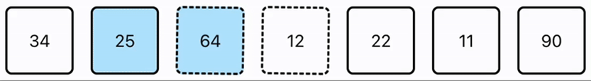  
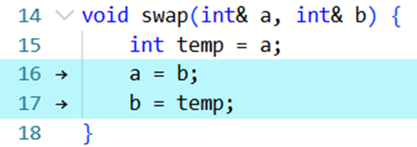  

- In **Blau** markiert sind die Elemente, die im aktuellen Schritt getauscht wurden.  
- Die Elemente *64* und *12* sind gestrichelt umrandet und wackeln, um anzuzeigen, dass sie im nächsten Schritt vertauscht werden.  
- Im Code werden die dafür verantwortlichen Zeilen hervorgehoben.  

---

### 2. Ersetzung von Elementen
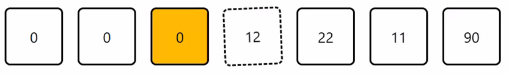  
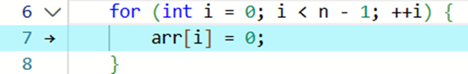  

Hier ist zu sehen, wie Elemente sukzessive durch **0** ersetzt werden. Die Animation folgt dabei direkt dem Codefluss.

---

### 3. Markierung des Pivot-Elements
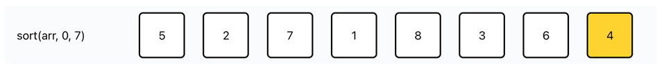  
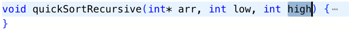  

- Das aktuelle **Pivot-Element** wird in **Orange** hervorgehoben.  
- Dieses wird automatisch aus dem Parameter der Funktion `quickSortRecursive` abgeleitet.

---

### 4. Rückgabewerte
  
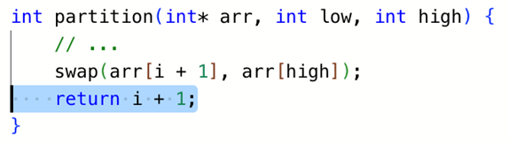  

Die Visualisierung erkennt auch **Rückgabewerte von Funktionen** und markiert deren Einfluss direkt in der Liste.

---

### 5. Rekursive Aufrufe
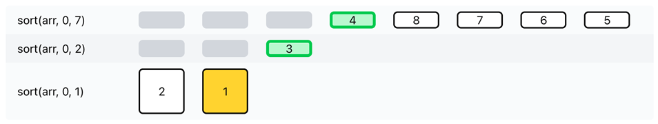  
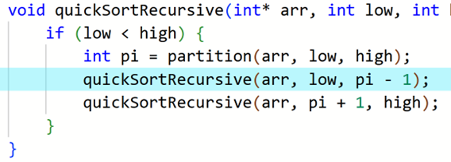  

Rekursionen werden klar erkennbar dargestellt, sodass nachvollziehbar ist, welche Aufrufe gerade aktiv sind.

---

### 6. Vergleichsoperationen
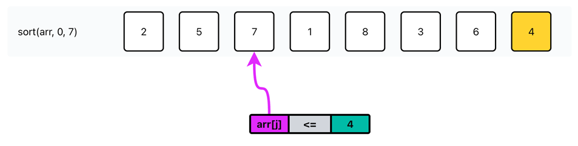  
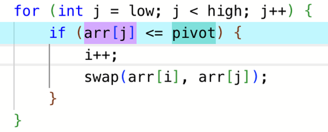  

Auch **Vergleiche** zwischen Elementen werden erkannt und im Ablauf hervorgehoben.

---

# Installation

1. Konfiguriere die `.env`-Datei (z. B. Port, Umgebungsvariablen).  
2. Starte das Projekt mit:  
   ```sh
   docker compose up -d
    ```
3. Wenn der Port in der .env-Datei nicht angepasst wurde, ist die Webseite anschließend unter http://localhost:3000  erreichbar.

# Ausblick

Die gezeigte Plattform ist ein Prototyp, der exemplarisch an Sortieralgorithmen demonstriert wird.
Das Visualisierungskonzept ist jedoch universell erweiterbar:
In Zukunft könnten weitere Algorithmen oder sogar komplexere Programmieraufgaben unterstützt werden, um Lernenden tiefere Einblicke in das Verhalten ihres Codes zu geben.